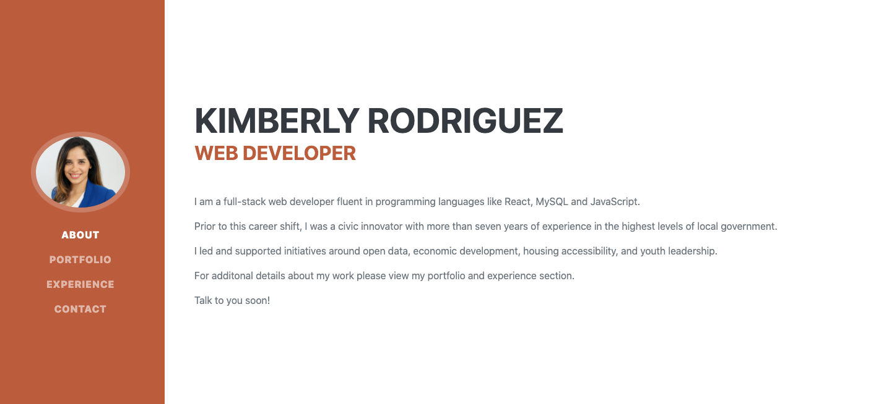

# 20 React: React Portfolio

## Table of Contents

* [Description](#description)
* [Instalation](#instalation)
* [Tools](#tools)
* [Contact](#contact)
* [License](#license)
* [Acknowledgements](#acknowledgements)

## Description

To create a portfolio using React that showcases projects and shares contact information


## Instalation

* Clone the repo (please reference the links below).
```md 
https://github.com/Kimberly-Rodriguez/Workout_Tracker

```

When the user loads the page, they can create a new workout or continue with their last workout.

The user can:

  * Add exercises to the most recent workout plan.

  * Add new exercises to a new workout plan.

  * View the combined weight of multiple exercises from the past seven workouts on the `stats` page.

  * View the total duration of each workout from the past seven workouts on the `stats` page.



[Site link](https://intense-sierra-76167.herokuapp.com/)

## Tools

* This project was built using HTML, CSS and React principles.


## Contact

If you have any questions about my work OR wish to collaborate in the future please contact me via email: krodriguez.ucla@gmail.com OR feel free to connect via GitHub: [Kimberly-Rodriguez](https://github.com/Kimberly-Rodriguez).

## License 

Licensed under the [MIT License](LICENSE).

## Acknowledgements

[UCLA Extension Coding Bootcamp](https://bootcamp.uclaextension.edu/coding/)
